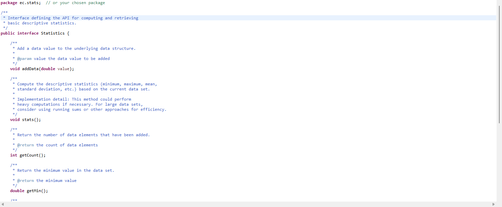
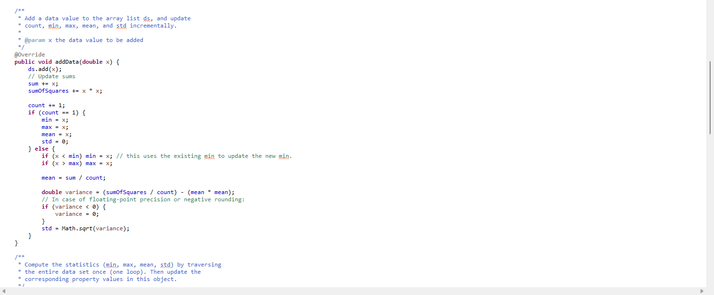
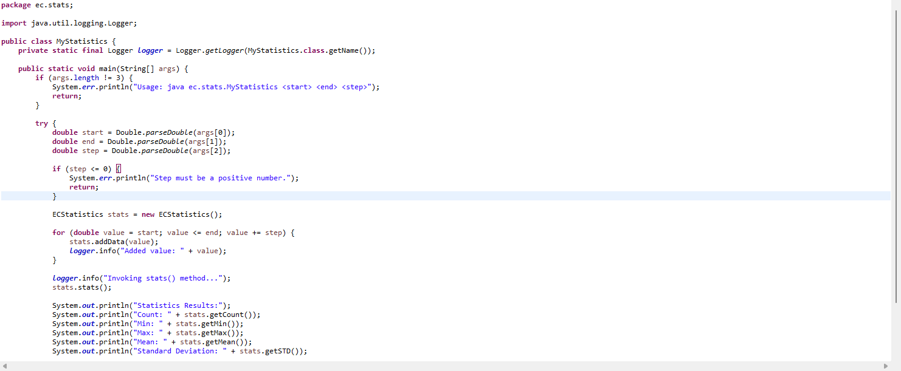
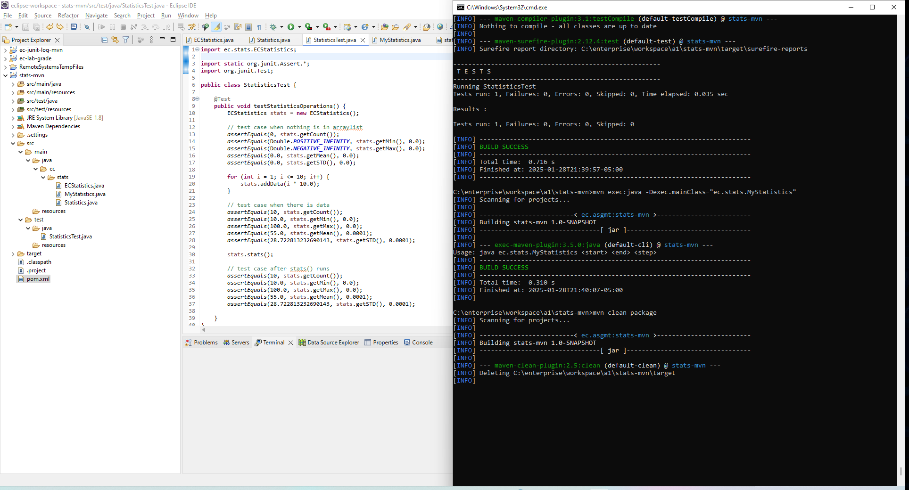
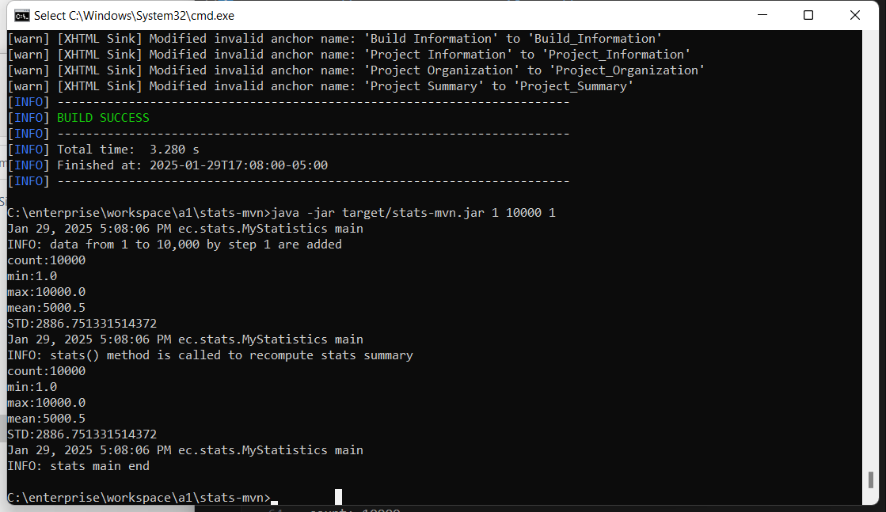
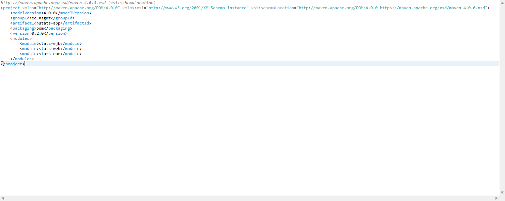
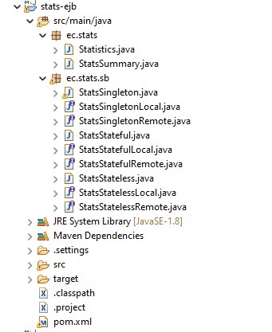
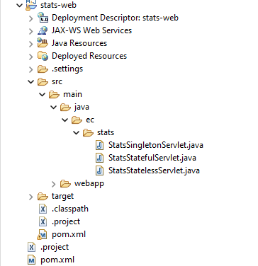
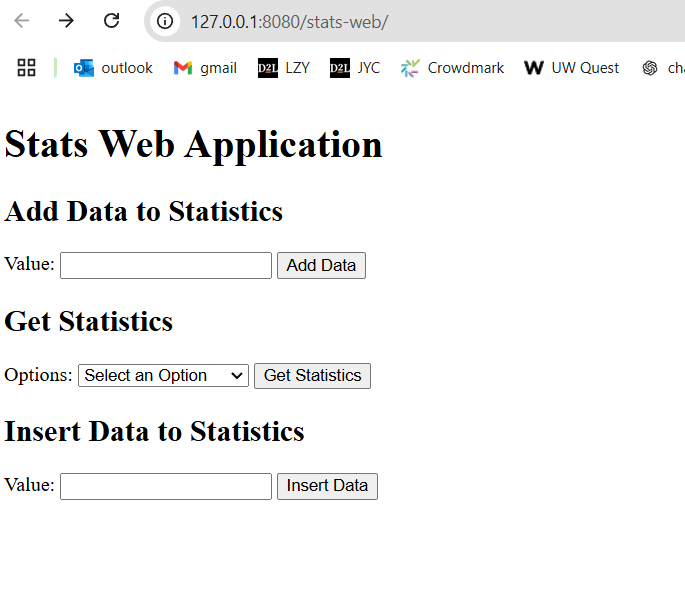
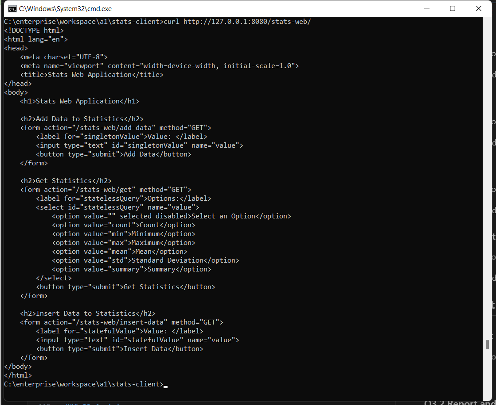

# A1 Report

Author: Zongyang Li

Date: 2025-01-26 

Check [readme.txt](readme.txt) for course work statement and self-evaluation. 
  
## Q1 Descriptive statistics computing project (programming)

### Q1.1 Creating pom.xml

Complete? Yes or No 

<!--If you answer Yes, insert one or more screenshot images to show the completion. -->

{width=90%}

<!--If No, add a short description to describe the issues encountered.-->

### Q1.2 Interface design

Complete? Yes or No 

<!--If you answer Yes, insert one or more screenshot images to show the completion. -->

{width=90%}

<!--If No, add a short description to describe the issues encountered.-->

### Q1.3 Implementation

Complete? Yes or No 

<!--If you answer Yes, insert one or more screenshot images to show the completion. -->

{width=90%}

<!--If No, add a short description to describe the issues encountered.-->

### Q1.4 Main program

Complete? Yes or No 

<!--If you answer Yes, insert one or more screenshot images to show the completion. -->

{width=90%}

<!--If No, add a short description to describe the issues encountered.-->

### Q1.5 JUnit test

Complete? Yes or No 

<!--If you answer Yes, insert one or more screenshot images to show the completion. -->

{width=90%}

<!--If No, add a short description to describe the issues encountered.-->

### Q1.6 Logging and documentation

Complete? Yes or No 

<!--If you answer Yes, insert one or more screenshot images to show the completion. -->

{width=90%}

<!--If No, add a short description to describe the issues encountered.-->

## Q2 Java EE project on stats (programming)

### Q2.1 stats-app

Complete? Yes or No 

<!--If you answer Yes, insert one or more screenshot images to show the completion. -->

{width=90%}

<!--If No, add a short description to describe the issues encountered.-->

### Q2.2 stats-ejb

Complete? Yes or No 

<!--If you answer Yes, insert one or more screenshot images to show the completion. -->

{width=90%}

<!--If No, add a short description to describe the issues encountered.-->

### Q2.3 stats-web

Complete? Yes or No 

<!--If you answer Yes, insert one or more screenshot images to show the completion. -->

{width=90%}

<!--If No, add a short description to describe the issues encountered.-->

### Q2.4 stats-ear

Complete? Yes or No 

<!--If you answer Yes, insert one or more screenshot images to show the completion. -->

{width=90%}

<!--If No, add a short description to describe the issues encountered.-->

### Q2.5 stats-client

Complete? Yes or No 

<!--If you answer Yes, insert one or more screenshot images to show the completion. -->

{width=90%}

<!--If No, add a short description to describe the issues encountered.-->

## Q3 Batch test (test)

### Q3.1 Create test output

Complete? Yes

[test output](test_output.txt)

### Q3.2 Report and submission packaging

Complete? Yes

[test output](test_output.txt)

**References**

1. CP630 a1
2. Add your references if you used any. 
